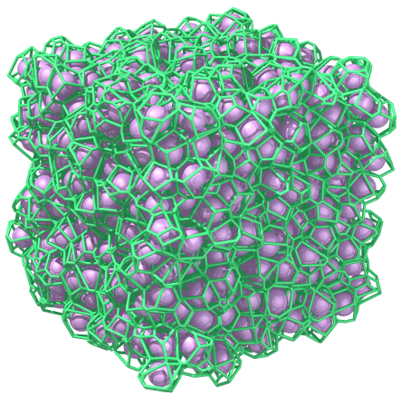

# Povray projects

Project: [packed spheres in a box](https://github.com/AmirNi2016/Povray/tree/master/Packed%20Speheres%20in%20a%20box). The voronoi tessellation is done using http://math.lbl.gov/voro++/, and a movie of packing is made using the cylinder sample. 

