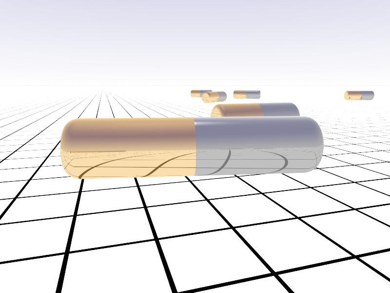

# Povray projects

Project: [Electrocatalytic nanomotors]

Project: [Packed spheres in a box](https://github.com/AmirNi2016/Povray/tree/master/Packed%20Speheres%20in%20a%20box). The voronoi tessellation is done using http://math.lbl.gov/voro++/, and the video [PackedSpheres.mp4](https://github.com/AmirNi2016/Povray/blob/master/Packed%20Speheres%20in%20a%20box/PackedSpheres.mp4)
of packing is made following the cylinder sample. 

